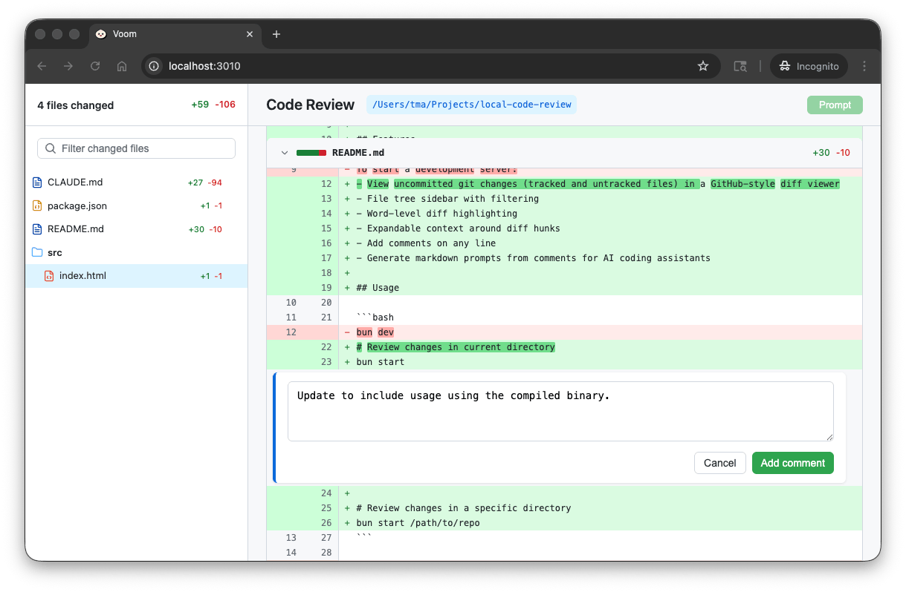
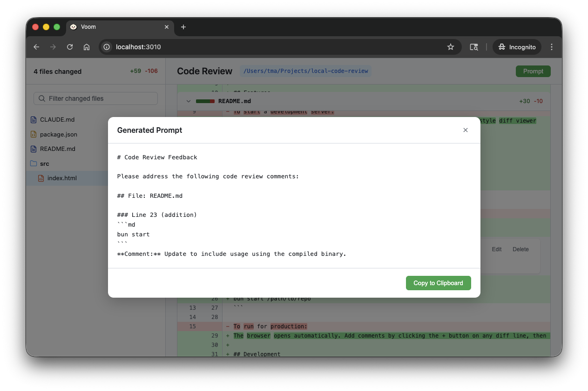

# Voom

A local code review tool that displays git diffs in a web UI and generates prompts for LLM coding agents. It helps
put me in a code review mindset without needing me to commit and push first.





## About the name
I was reading *The Cat in the Hat Comes Back* to my son one night after working on this project. In the book, Voom
is a deus ex machina that is used to clean up pink spots. Which seems apt for a tool that helps clean up code generated
by Claude (my AI of choice).

## Features

- View uncommitted git changes (tracked and untracked files) in a GitHub-style diff viewer
- File tree sidebar with collapsible directories and filtering
- Word-level diff highlighting
- Image diff support
- Expandable context around diff hunks
- Add comments on any line
- Track files as viewed with progress indicator
- Generate markdown prompts from comments for AI coding assistants
- Single-file mode for large diffs (auto-enabled for 30+ files or 1500+ changed lines, with keyboard navigation via ←/→)

## Requirements

Building Voom requires [Bun](https://bun.sh), a fast JavaScript runtime. Install it with:

```bash
# macOS/Linux
curl -fsSL https://bun.sh/install | bash

# Windows (PowerShell)
powershell -c "irm bun.sh/install.ps1 | iex"

# Or via Homebrew
brew install oven-sh/bun/bun
```

Once installed, the standalone binary has no runtime dependencies.

## Installation

### Standalone Binary (Recommended)

Build a standalone executable that requires no dependencies:

```bash
bun install
bun run build:voom        # Build for current platform
```

Then move the binary to your PATH:

```bash
# macOS/Linux
mv voom /usr/local/bin/

# Or add to a custom bin directory
mv voom ~/bin/
```

### Cross-Platform Builds

Build for all platforms at once:

```bash
bun run build:voom:all
```

This creates binaries in `dist-executables/`:
- `voom-macos-arm64` - macOS Apple Silicon
- `voom-macos-x64` - macOS Intel
- `voom-linux-x64` - Linux x64
- `voom-windows-x64.exe` - Windows x64

## Usage

### With Standalone Binary

```bash
# Review changes in current directory
voom

# Review changes in a specific directory
voom /path/to/repo
```

### With Bun (Development)

```bash
# Review changes in current directory
bun start

# Review changes in a specific directory
bun start /path/to/repo
```

The browser opens automatically. Add comments by clicking the + button on any diff line, then click "Prompt" to generate a formatted prompt for your AI assistant.

## Development

```bash
bun install
bun dev
```

## Configuration

- Default port: 3010 (auto-increments if in use)
- Set `PORT` environment variable to change default port
